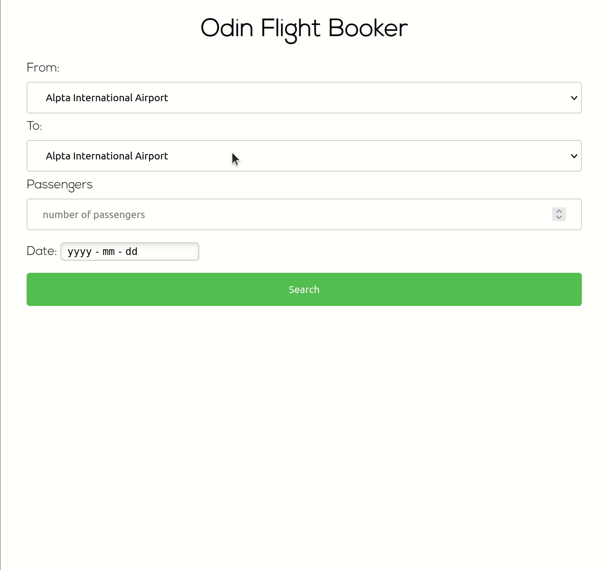

# Odin Flight Booker

## Project Requirements

This is a one-way flight booker.

The first three steps of a typical checkout process for booking a one-way flight:

A typical airline booking flow:

1.  Enter desired dates / airports and click “Search”
2.  Choose from among a list of eligible flights
3.  Enter passenger information for all passengers
4.  ~~Enter billing information~~

Step 4 would be done via integration of something like Paypal, via a gem or an SDK or Stripe.

[Link to project instruction](https://www.theodinproject.com/courses/ruby-on-rails/lessons/building-advanced-forms)

[View my app in browser](https://mighty-badlands-64879.herokuapp.com/)

## App Flow

1. Search for a flight
2. Pick a flight
3. Enter Passenger information
4. Receive email confirmation
5. Display booking information

## Demo



## Features
<ul>
  <li>Implented PostgreSQL database in Ruby on Rails application</li>
  <li>Using Heroku scheduler, two rake tasks are scheduled to continuously update flights in the database.</li>
  <li>Wrote model, integration and request specs using RSpec.</li>
  <li>Utilized Rails ActionMailer to send confirmation emails after succesfully booking a flight</li>
</ul>

## Installation

Prerequisites: Rails, Git, and Bundler
1. Clone this repo ([Instructions](https://docs.github.com/en/github/creating-cloning-and-archiving-repositories/cloning-a-repository-from-github/cloning-a-repository))
2. Navigate into this project's directory ```cd flight_booker```
3. Install the required gems, by running ```bundle install```
4. Migrate the database, by running ```rails db:migrate```
5. Seed the database, by running ```rails db:seed```
6. Start the local server, by running ```rails server```
7. Open a browser and type ```http://localhost:3000```

## Running Specs
* Navigate to project directory and type `rspec` to run entire spec suite.
* See [RSpec docs](https://github.com/rspec/rspec-rails#running-specs) for more ways to run specs


